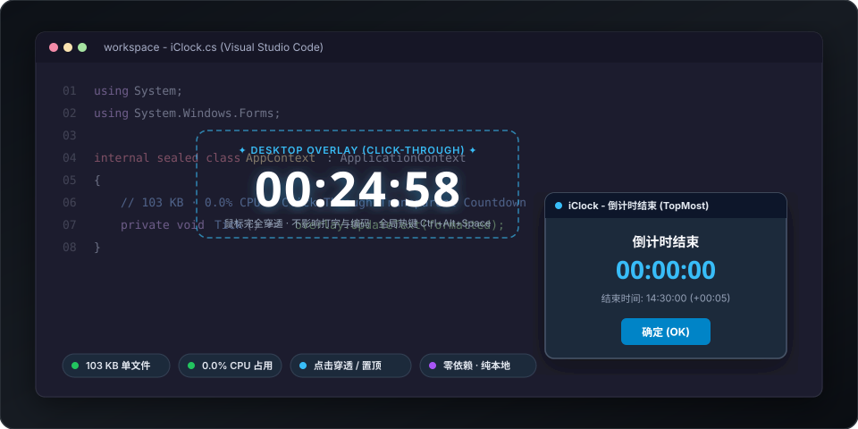

<div align="center">

# ⏱️ iClock

### 专为开发者与效率玩家打造的 Windows 极简透明悬浮倒计时

[](https://github.com/francodeyvison183-collab/iClock/releases/latest)
[](https://github.com/francodeyvison183-collab/iClock/releases/latest)
[](https://github.com/francodeyvison183-collab/iClock/releases/latest)
[-brightgreen)]()
[](LICENSE)

<p align="center">
  <b>单文件 103 KB · 0.0% CPU · 鼠标点击穿透 · 全局热键 · 零第三方依赖 · 纯本地隐私</b>
</p>

<p align="center">
  <a href="https://github.com/francodeyvison183-collab/iClock/releases/latest"><b>🚀 立即下载最新版 (iClock-1.0.0-windows.zip)</b></a> ·
  <a href="README_EN.md">English Documentation</a> ·
  <a href="docs/USER_GUIDE.md">使用指南</a> ·
  <a href="CHANGELOG.md">更新日志</a>
</p>



</div>

---

## 💡 为什么选择 iClock？

市面上的倒计时与番茄钟软件，往往动辄 **100MB+**（Electron 臃肿应用），常驻后台持续消耗 CPU 与内存，甚至带有弹窗广告和后台遥测；而传统窗口则会死死遮挡桌面，干扰鼠标操作。

**iClock 坚持极致的工程师极简克制哲学**：

* 🪟 **透明置顶 & 鼠标穿透**：倒计时文字自然悬浮于桌面之上，默认处于完全点击穿透状态，鼠标可直接穿透点击下方的 IDE、文档或游戏，完全不抢焦点、不阻挡操作。
* ⚡ **单文件 103 KB & 0.0% CPU**：不含任何第三方依赖或庞大运行时。经过深度的 GDI 资源预分配与动态心跳对齐优化，运行期间每秒 **0 堆内存分配**，唤醒开销降至极限，笔记本长驻运行零耗电。
* ⌨️ **全局热键随心掌控**：默认 `Ctrl + Alt + Space` 一键盲开/暂停，无需离开当前工作窗口。
* 🔔 **结束置顶强提醒**：倒计时结束时文字自动隐去，弹出强置顶提示窗口与循环提示音，必须手动确认才关闭，绝不错过关键节点。
* 🔒 **纯本地、零网络请求**：设置与历史记录仅保存在本地应用目录，不联网、不收集任何隐私遥测，干净透明。
* 🌍 **中英双语与历史日志**：托盘菜单一键无缝切换语言；自动生成按天归档的专注历史 TSV 文件。

---

## 📊 性能与体验横向对比

| 核心维度 | **iClock (本项目)** | 常见 Electron 计时器 | Windows 自带闹钟 |
| :--- | :--- | :--- | :--- |
| **安装包体积** | ⚡ **103 KB** (绿色单文件，即下即用) | 120 MB ~ 250 MB | 预装应用 |
| **常驻内存** | ⚡ **~15 MB** (物理基线) | 150 MB ~ 300 MB | ~30 MB |
| **CPU 占用** | ⚡ **0.0%** (动态心跳对齐) | 0.5% ~ 3.0% (后台轮询) | 0.0% |
| **交互阻碍** | ⚡ **完全点击穿透，无边框** | 实体窗口遮挡代码与网页 | 最小化或全屏窗口 |
| **启动速度** | ⚡ **< 100ms** (瞬间启动) | 2 ~ 4 秒 | 1 ~ 2 秒 |
| **网络行为** | ⚡ **0 联网请求，纯本地** | 多数携带统计与更新上报 | 绑定微软在线账户 |

---

## 🎯 典型使用场景

* 🍅 **开发者深度心流 / 番茄工作法**：写代码时一键启动 25 分钟，数字透明显示在屏幕一角，不遮挡编辑器视线。
* 🎤 **技术分享 / 会议演讲控时**：在屏幕右下角低调提示剩余发言时间，鼠标自由翻动 PPT。
* 🎮 **游戏技能 / 任务等待冷却**：全屏或无边框窗口直接穿透，激烈操作绝不误点。
* ☕ **久坐起身 / 喝水护眼提醒**：设定 45 分钟，到点后强制置顶提醒活动身体。

---

## 🚀 快速上手

### 1. 下载即用
1. 前往 [GitHub Releases](../../releases/latest) 下载 `iClock-1.0.0-windows.zip`。
2. 解压得到单个 `iClock.exe`，双击即可运行（无任何安装过程）。
3. 默认情况下，启动后倒计时处于待命状态（屏幕不显示文字）。

### 2. 常用操作
* **启动 / 暂停**：按下全局快捷键 `Ctrl + Alt + Space`（可在设置中自定义）。
* **调整文字位置**：右键点击右下角系统托盘小图标 $\rightarrow$ 选择 **“调整文字位置”** $\rightarrow$ 拖拽半透明区域定位 $\rightarrow$ 再次从托盘点击 **“完成位置调整”**。
* **自定义配置**：右键托盘图标 $\rightarrow$ **“设置”**，可自定义时长（1~1440分钟）、字号、颜色、显示格式（`HH:MM:SS` / `MM:SS` / 中文单位）、结束提示词、开机自启等。
* **查看专注历史**：右键托盘图标 $\rightarrow$ **“查看今日记录”**，按日查看已完成或重置的倒计时历史。

---

## 🛠️ 从源码构建

本项目采用极简设计，基于 Windows 原生 C# 与 .NET Framework 4.x，**无需安装任何庞大的 Visual Studio 或依赖包**，使用系统自带的 `csc.exe` 即可极速编译：

```powershell
git clone https://github.com/francodeyvison183-collab/iClock.git
cd iClock
.\build.ps1
```
> 编译耗时不到 1 秒，产物输出在 `dist/iClock.exe`（单文件约 103 KB）。详见[构建说明](docs/BUILDING.md)。

---

## 🔒 隐私与安全说明

* **存储位置**：所有配置文件与历史记录均存放在本地 `%APPDATA%\iClock`，卸载时直接删除该文件夹即可。
* **系统修改**：仅当在设置中显式勾选“开机自启动”时，才会写入当前用户的注册表自启项 `HKCU\Software\Microsoft\Windows\CurrentVersion\Run`。
* **零网络通信**：代码无任何 Socket、HTTP 或遥测 API 调用，可完全断网运行。详见[隐私说明](docs/PRIVACY.md)。

---

## 💖 支持与赞赏

如果您觉得 iClock 让您的桌面更清爽、工作更专注，欢迎为本项目点亮一颗 ⭐️ **Star**，也欢迎请作者喝一杯咖啡鼓励持续维护：

<div align="center">
  
  <p><b>微信扫一扫 赞赏作者</b></p>
  <p><i>感谢每一位支持开源创作的朋友！</i></p>
</div>

---

## 📄 开源许可

本项目基于 [MIT License](LICENSE) 开源许可，自由商用与个人使用。欢迎提交 Issue 与 Pull Request！
