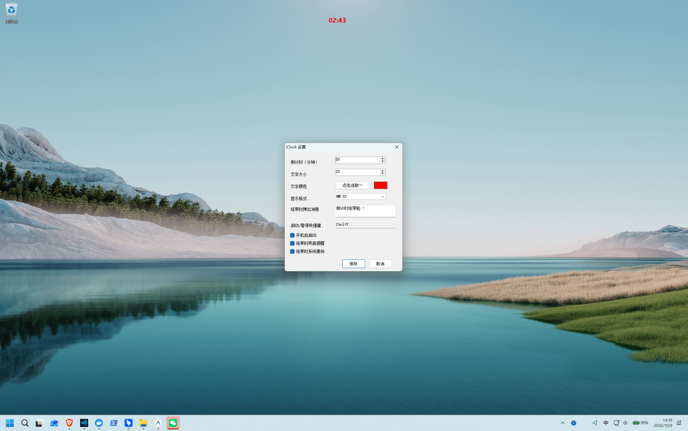

<div align="center">

# ⏱️ iClock

### Ultra-lightweight, Transparent Desktop Countdown for Windows

[](https://github.com/francodeyvison183-collab/iClock/releases/latest)
[](https://github.com/francodeyvison183-collab/iClock/releases/latest)
[](https://github.com/francodeyvison183-collab/iClock/releases/latest)
[](https://github.com/microsoft/winget-pkgs/pull/449511)
[](LICENSE)

<p align="center">
  <b>Single 126 KB Binary · RAM &lt; 15 MB · Mouse Click-Through · Global Hotkey · Zero Dependencies · Pure Local Privacy</b>
</p>

<p align="center">
  <a href="https://francodeyvison183-collab.github.io/iClock/"><b>🌐 Website</b></a> ·
  <a href="https://github.com/francodeyvison183-collab/iClock/releases/latest"><b>🚀 Download</b></a> ·
  <a href="https://francodeyvison183-collab.github.io/iClock/llms.txt"><b>🤖 llms.txt</b></a> ·
  <a href="README.md">简体中文说明</a> ·
  <a href="docs/USER_GUIDE.md">User Guide</a> ·
  <a href="CHANGELOG.md">Changelog</a>
</p>



</div>

---

## 💡 Why iClock?

Most timer and Pomodoro applications on Windows are bloated **100MB+** Electron packages that continuously chew through CPU and RAM, often bundled with telemetry or ads, while their solid windows obstruct your workspace.

**iClock adheres to extreme engineering minimalism**:

* 🪟 **Transparent & Click-Through**: Clean countdown numbers floating naturally on your desktop. Mouse clicks pass straight through to underlying IDEs, documents, or games without stealing window focus.
* ⚡ **126 KB & 0.0% CPU**: Zero third-party packages or heavy runtimes. Powered by pre-allocated GDI caching and dynamic heartbeat alignment, guaranteeing **0 heap allocations per second** during countdown.
* ⌨️ **Global Hotkey Control**: Start or pause blind from anywhere with `Ctrl + Alt + Space` (customizable) without switching active windows.
* 🔔 **TopMost Confirmation Alert**: When the countdown completes, the overlay hides cleanly, displaying a persistent topmost dialog and alarm that requires user acknowledgment.
* 🔒 **100% Local & Private**: Config and logs stay strictly inside your local `%APPDATA%\iClock`. Zero network requests, zero telemetry.
* 🌍 **Bilingual & History Logs**: Seamlessly switch between English and Simplified Chinese in Settings. Daily countdown records are saved as clean TSV files.

---

## 📊 Comparison

| Metric | **iClock (This Project)** | Typical Electron Timer | Windows Clock App |
| :--- | :--- | :--- | :--- |
| **Package Size** | ⚡ **126 KB** (Portable single exe) | 120 MB ~ 250 MB | Pre-installed |
| **Memory (RAM)** | ⚡ **~15 MB** (Physical baseline) | 150 MB ~ 300 MB | ~30 MB |
| **CPU Usage** | ⚡ **0.0%** (Heartbeat aligned) | 0.5% ~ 3.0% (Polling) | 0.0% |
| **Interaction** | ⚡ **Full click-through, borderless** | Solid window blocking view | Minimized or full window |
| **Cold Startup** | ⚡ **< 100ms** (Instantaneous) | 2 ~ 4 seconds | 1 ~ 2 seconds |
| **Network Traffic**| ⚡ **0 network calls, 100% offline** | Telemetry / Update checks | Microsoft account sync |

---

## 🎯 Use Cases

* 🍅 **Deep Focus / Pomodoro Technique**: Fire a 25-minute timer without covering code or documentation.
* 🎤 **Presentations & Meeting Timekeeping**: Keep track of speech duration in the screen corner while freely controlling slides.
* 🎮 **Gaming & Skill Cooldowns**: Borderless click-through prevents accidental mouse clicks during gameplay.
* ☕ **Posture & Eye-Rest Breaks**: Set a 45-minute countdown for mandatory stretch reminders.

---

## 🚀 Quick Start

### Option A: Windows Package Manager WinGet (Recommended)

Run the following in PowerShell or Command Prompt:
```powershell
winget install FrancoDeyvison.iClock
```
> Automatically downloads, verifies, installs, and adds `iClock` to system PATH so you can launch it from any terminal.

### Option B: Scoop Package Manager

```powershell
scoop install https://raw.githubusercontent.com/francodeyvison183-collab/iClock/main/scoop/iclock.json
```

### Option C: Standalone Portable Binary

1. Go to [GitHub Releases](../../releases/latest) and download `iClock-1.02-windows.zip` or `iClock-1.02-windows.exe`.
2. Double-click to launch (no installer, no registry residue).
3. The overlay stays hidden until you start a countdown.

### Common Controls

* **Start / Pause**: Press global hotkey `Ctrl + Alt + Space` (configurable in settings).
* **Adjust Position**: Right-click the system tray icon $\rightarrow$ **Adjust text position** $\rightarrow$ drag the translucent area $\rightarrow$ click **Finish position adjustment**.
* **Settings**: Right-click tray $\rightarrow$ **Settings…** to configure duration (1~1440 min), font size (default 20), color (default red), format (default `MM:SS`, `HH:MM:SS` / Chinese units), end message, and Windows startup.
* **View History**: Right-click tray $\rightarrow$ **View today's history…** to inspect completed or reset countdown sessions.

---

## ❓ Frequently Asked Questions (FAQ)

* **Q: Does it interfere with mouse clicks when gaming or coding?**  
  **A**: No. iClock leverages the Windows native `WS_EX_TRANSPARENT` style. Floating digits remain on the topmost layer, but all mouse clicks and scrolls pass through to underlying applications without stealing window focus.
* **Q: Why is the binary only 126 KB?**  
  **A**: Engineering purity. Built with Windows native C# and GDI+ rendering, avoiding any 100MB+ Electron wrappers. Runtime RAM consumption stays strictly under 15 MB.
* **Q: Is it safe, clean, and ad-free?**  
  **A**: 100% open-source under the MIT License. Zero ads, zero background services, zero telemetry. Exiting completely releases all resources. See [PRIVACY.md](docs/PRIVACY.md).

---

## 🛠️ Build from Source

Built with native C# and standard Windows .NET Framework 4.x. **No heavy Visual Studio installation required** — compiles with built-in `csc.exe` in under one second:

```powershell
git clone https://github.com/francodeyvison183-collab/iClock.git
cd iClock
.\build.ps1
```
> Output binary is generated at `dist/iClock.exe` (126 KB). See [Build Guide](docs/BUILDING.md).

---

## 🔒 Privacy & Security

* **Local Storage**: All settings and history are stored locally in `%APPDATA%\iClock`. Simply delete this directory to uninstall cleanly.
* **System Registry**: Only touches `HKCU\Software\Microsoft\Windows\CurrentVersion\Run` if you explicitly enable auto-start.
* **Zero Network Activity**: No network sockets, HTTP requests, or telemetry code. See [Privacy](docs/PRIVACY.md).

---

## 💖 Support & Sponsor

If you find iClock helpful for your daily workflow, consider giving this repository a ⭐️ **Star**, or support the author with a coffee:

<div align="center">
  
  <p><b>Scan with WeChat to Sponsor</b></p>
  <p><i>Thank you for supporting independent open-source craft!</i></p>
</div>

---

## 📄 License

Licensed under the [MIT License](LICENSE). Free for personal and commercial use. Contributions and PRs welcome!
